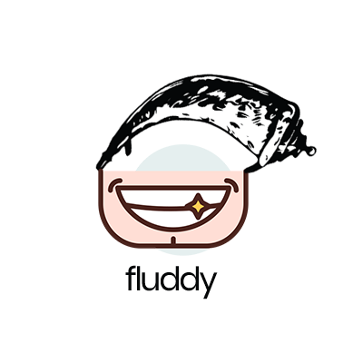

<div align="center">
  
  <p align="center">
	  
	  <!---->
	  
	 
	  
  </p>
</div>
# fluddy
*fluddy* is an effective, lightweight and dependency-free command-line utility for managing, launching, updating and creating Flask Apps.


<!-- ABOUT THE PROJECT -->
## Description


       __ _           _     _
      / _| |         | |   | |
     | |_| |_   _  __| | __| |_   _
     |  _| | | | |/ _` |/ _` | | | |
     | | | | |_| | (_| | (_| | |_| |
     |_| |_|\__,_|\__,_|\__,_|\__, |
                               __/ |
      Version: 0.0.1          |___/


Flask is fast becoming the most popular web development framework for Python. Developers will typically manage multiple Flask apps individually where each app will rely on its own virtual environment - this can become tedius when launching and updating multiple Flask Apps in development. 

Flask Buddy (fluddy) allows developers to launch and update their individual Flask Apps through a simple Command-Line Interface. CLI functionality also allows developers to create a launchable 'Hello from Fluddy' Flask App and to add previously created Flask Apps to fluddy for painless launches and updates.

### Built With

* [Python 3.5]()


<!-- GETTING STARTED -->
## Getting Started

Available via pip or local install.

### Installation
 
* Pip installation

```
pip install fluddy
```
* Download and `cd` to flask-buddy

```
pip install .
```

<!-- USAGE EXAMPLES -->
## Usage
Add a Flask App to fluddy: 

```
fluddy --add projectName /exact/path/to/app/dir
```

Launch a Flask App:

```
fluddy projectName
```
Create a Flask App:

```
fluddy --create projectName /exact/path/to/save/dir
```
Update a Flask App (venv):

```
fluddy --update projectName
```
Remove a Flask App from fluddy:

```
fluddy --remove projectName
```


<div align="center">
<br>
 
</div>
<!-- ROADMAP -->
## Roadmap

See [open issues](https://github.com/jakedent/fluddy/issues) for a proposed list of features (and 🐞's).


<!-- CONTRIBUTING -->
## Contributing

Contributions **welcomed and appreciated** under the categories:

1. General Improvements.
2. Optimisation of code.
3. Optimisation of structure.
3. Recommendations.
4. Additional features.


<!-- LICENSE -->
## License

Distributed under the MIT License. See `LICENSE` for more information.


<!-- CONTACT -->
## Contact

[Jacob Dent](https://fairlynormalpeople.com) - info@jacobdent.com

[https://github.com/jakedent/fluddy](https://github.com/jakedent/fluddy)

[https://pypi.org/project/fluddy/](https://pypi.org/project/fluddy/)

